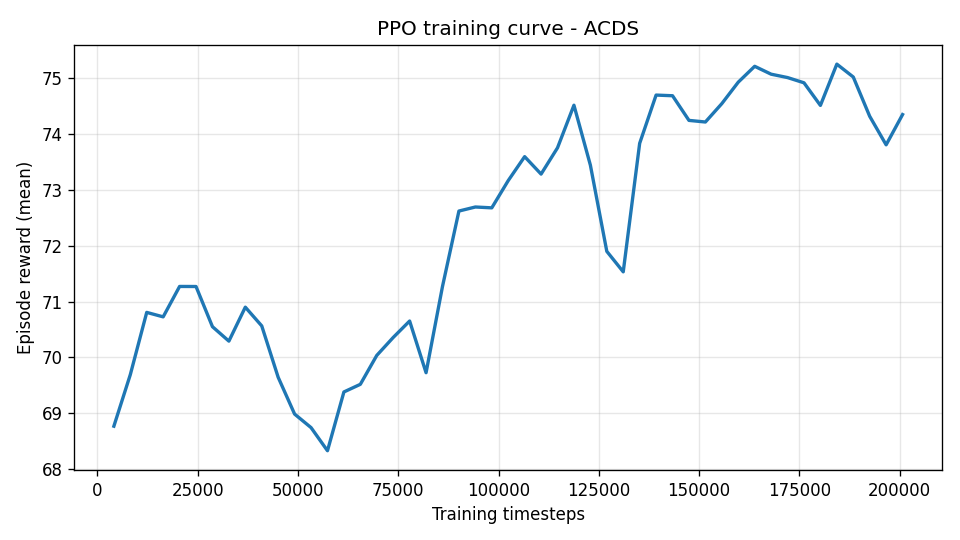
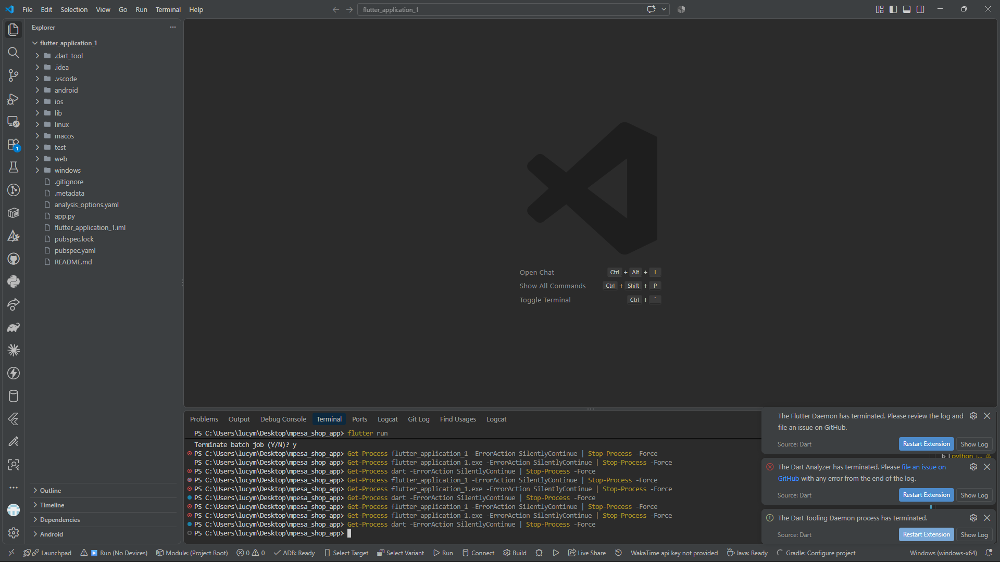

# ACDS - Autonomous Cyber Defense Simulator

👉 **[Try the live demo](https://acds-autonomous-cyber-defense-g8n2yia4ngxdlu3mmkrbdn.streamlit.app)**

A reinforcement-learning driven cyber defense simulator where a PPO agent
learns to defend a 10-host network against attacks calibrated to the
**CICIDS2017** intrusion detection dataset.

## What It Does

- Simulates a 10-host network (router + servers + workstations)
- Generates structured attacks (DoS, brute force, CVE exploits, botnet, port scan)
  whose intensity and frequency distributions are **calibrated to real
  statistics extracted from 2.83M labeled flows** in the CICIDS2017 dataset
- Uses **multi-discrete action space**: the agent picks both `action_type`
  AND `target_host` each step
- Attacks follow a **3-stage kill chain** (recon -> exploit -> escalate)

### Actions

| ID | Action | Effect |
|----|--------|--------|
| 0 | noop | do nothing |
| 1 | patch | remove a CVE from the target host |
| 2 | block_port | close one port on the target host |
| 3 | isolate | remove all ports from target (small health cost) |
| 4 | scan | reveal hidden target state |

## Architecture

- **Simulation layer** - `Host`, `Network`, `CyberDefenseEnvV7` (Gymnasium)
- **Cybersecurity layer** - `CICIDSAttackGenerator` calibrated to real data
- **ML/AI layer** - PPO (Stable-Baselines3) with `MultiDiscrete([5, 10])`
- **Dashboard** - Streamlit live visualization

## Results (v7, 800k PPO timesteps)

Fair evaluation on 20 independent seeds (1000-1019):

| Policy | Mean reward | Compromised | Unique actions |
|--------|------------|-------------|----------------|
| **PPO (best checkpoint)** | **+76.31** | **0.00** | **5 / 5** |
| PPO (final checkpoint) | +76.49 | 0.00 | 5 / 5 |
| round_robin heuristic | +81.91 | 0.50 | 1 / 5 |
| Random | +23.69 | 2.20 | - |
| noop | -45.72 | 7.15 | 1 / 5 |
| isolate_worst heuristic | -76.45 | 5.95 | 1 / 5 |

> Both v7 checkpoints land within noise of each other (+76.3 vs +76.5, std ~ 1.0 over 20 seeds). The best checkpoint is what the dashboard loads by default.
>
> The Random row is a single 20-episode sample; the random policy is unseeded, so it varies +/-10 between runs. Trained-agent numbers are deterministic.

**Key results:**
- **+52.6 reward gap over random** (trained vs random)
- **0.00 compromised hosts** across all 20 eval seeds (vs 2.20 for random)
- **PPO uses all 5 action types** (best checkpoint: block_port 37.7%, isolate 47.1%, patch 6.7%, noop 5.7%, scan 2.8%)

### On the round_robin heuristic

A simple **`round_robin` heuristic** — cycle through hosts isolating each
in turn — scores **+81.9**, slightly higher than PPO's +76.3.

**Why this matters:** the environment has a **simple, non-obvious dominant
strategy**. By step 10, round-robin has systematically isolated all hosts,
making the network largely attack-immune. In contrast, the "obvious"
strategy of isolating the *lowest-health* host (`isolate_worst`, -76.5)
performs poorly because attacks are distributed across hosts — playing
whack-a-mole leaves the rest of the network exposed.

**This is a legitimate finding** and illustrates the value of running
baselines before claiming ML superiority. On this environment, a
well-designed heuristic is competitive with RL.

### Training curve

## Baseline Comparison

To make the comparison rigorous, we benchmarked the trained PPO agent
against **6 hand-designed heuristics** on the v7 environment:

| Heuristic | Strategy |
|-----------|----------|
| `noop` | do nothing every step |
| `random` | sample random (action, target) pairs |
| `isolate_worst` | isolate the host with lowest health |
| `block_worst` | block one port on lowest-health host |
| `patch_most_vuln` | patch CVE on host with most CVEs |
| `round_robin` | isolate hosts in a fixed cycle |

Regenerate with:

    python scripts\baseline_heuristics.py --env v7 --episodes 20

## Live Dashboard

Run the interactive demo:

    streamlit run src\dashboard\app.py

Then open http://localhost:8501

Click **Run Episode(s)** to watch the trained agent defend the network in real time.

## Dataset: CICIDS2017

Attack distributions are calibrated from the **Canadian Institute for
Cybersecurity CICIDS2017** dataset:

- **2,830,743 labeled network flows** across 8 CSV files
- Attack groups extracted: `dos` (380K flows), `recon` (158K), `brute_force`
  (13K), `bot` (2K), `web` (2K)
- Statistics (mean/std/median/p95) computed per group for features like
  `Flow Bytes/s`, `Flow Duration`, `Flow Packets/s`
- Regenerate with:

      python scripts/extract_cicids_stats.py

Source: [https://www.unb.ca/cic/datasets/ids-2017.html](https://www.unb.ca/cic/datasets/ids-2017.html)

## What Was Hard

The project went through **seven environment versions**:

1. **v1** - placeholder random attacks. No causal chain from action to reward.
2. **v2** - real attacks with defense-modulated damage. Agent learned, but
   skill gap over random was tiny (+7).
3. **v3** - over-hardened. Signal died, policy collapsed to `noop`.
4. **v4** - rebalanced. Signal returned, gap still small.
5. **v5** - reward rebalance + entropy regularization. Stable, but limited by
   the discrete action space.
6. **v6** - switched to `MultiDiscrete([5, 10])` and added kill-chain attacks.
   Big jump in expressiveness but attacks were still synthetic.
7. **v7** - added CICIDS2017-calibrated attacks. Result: +76.3 reward,
   zero compromised hosts, competitive with the best heuristic.

The lesson: **RL is a signal problem, not a code problem.** The environment
must give the agent a causal chain from action to reward, the reward must be
tuned to allow learning, and the action space must be expressive enough to
solve the task. Tuning these is 80% of applied RL.

## Setup

    python -m venv .venv
    .venv\Scripts\activate
    pip install -r requirements.txt

**Optional:** download CICIDS2017 (2 GB) and extract statistics:

    python scripts\download_cicids.py
    python scripts\extract_cicids_stats.py

The extracted `data/cicids_stats.json` (5.7 KB) is committed, so the
generator works without the full dataset.

## Usage

**Train:**

    python scripts\train_ppo.py --env v7 --steps 400000

**Evaluate:**

    python scripts\evaluate_ppo.py --env v7 --episodes 20

**Baseline comparison:**

    python scripts\baseline_heuristics.py --env v7 --episodes 20

**Dashboard:**

    streamlit run src\dashboard\app.py

**TensorBoard:**

    tensorboard --logdir logs\v7

## Tests

    python tests\test_host.py
    python tests\test_network.py
    python tests\test_env_v3.py
    python tests\test_env_v6.py
    python tests\test_env_v7.py
    python tests\test_cicids_generator.py

## Project Layout

    acds-autonomous-cyber-defense/
    |-- src/
    |   |-- sim/            # Host, Network, CyberDefenseEnvV7
    |   |-- attacks/        # CICIDSAttackGenerator
    |   |-- dashboard/      # Streamlit app
    |-- scripts/
    |   |-- train_ppo.py
    |   |-- evaluate_ppo.py
    |   |-- baseline_heuristics.py
    |   |-- extract_cicids_stats.py
    |-- tests/
    |-- data/
    |   `-- cicids_stats.json  (committed; full dataset gitignored)
    |-- models/             # trained checkpoints
    `-- README.md

## Author

Moses ([@Moses1133](https://github.com/Moses1133))

