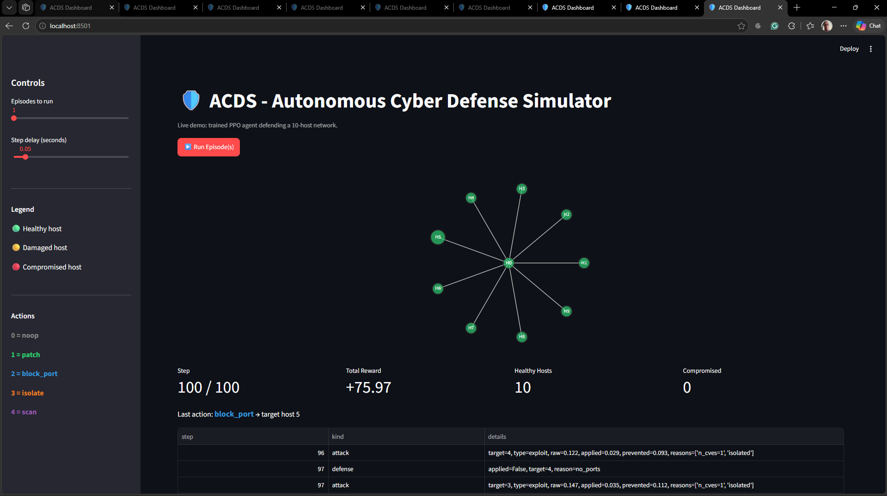

# ACDS - Autonomous Cyber Defense Simulator

A reinforcement-learning driven cyber defense simulator where an AI agent
learns to defend a network of hosts against realistic attacks (DoS, brute
force, CVE exploits).

## What It Does

- Simulates a 10-host network (router + servers + workstations)
- Generates structured attacks weighted by host vulnerabilities and open ports
- Lets a PPO agent choose defensive actions each step:
  - noop        - do nothing
  - patch       - remove a CVE from the most at-risk host
  - block_port  - close a port on the most at-risk host
  - isolate     - disconnect the host (small health cost)
  - scan        - reveal hidden host state
- Rewards survival, defense effectiveness, and low compromised-host count

## Architecture

- Simulation layer    - Host, Network, CyberDefenseEnv (Gymnasium)
- Cybersecurity layer - structured attacks: DoS, brute force, CVE exploits
- ML/AI layer         - PPO (Stable-Baselines3) with dense reward shaping
- Dashboard           - coming next: Streamlit live visualization

## Results

Trained on 200k timesteps of PPO on the v5 environment.

| Metric                              | Random | Trained    | Improvement  |
|-------------------------------------|--------|------------|--------------|
| Mean episode reward                 | +69.54 | **+76.96** | **+7.42**    |
| Hosts compromised at end            | 0.80   | **0.10**   | **8x fewer** |
| Episode length                      | 100    | 100        | -            |
| Value function explained_variance   | -      | 0.4-0.8    | -            |

Key finding: PPO discovered block_port is the dominant defensive action.
The policy achieves near-zero host compromise across all evaluation seeds.

## Live Dashboard

Run the interactive demo:

    streamlit run src\dashboard\app.py

Then open http://localhost:8501

Click **Run Episode(s)** to watch the trained agent defend the network in real time.

## What Was Hard

The project went through five environment versions:

1. v1 - placeholder random attacks. No causal chain from action to reward.
2. v2 - real attacks with defense-modulated damage. Learned, gap small.
3. v3 - over-hardened. Signal died, policy collapsed.
4. v4 - rebalanced. Signal returned, gap still small.
5. v5 (final) - reward rebalance + PPO collapse-prevention hyperparameters.

The lesson: RL is a signal problem, not a code problem. Tuning the environment is 80% of applied RL.

## Setup

    python -m venv .venv
    .venv\Scripts\activate
    pip install -r requirements.txt

## Usage

    python scripts\train_ppo.py
    python scripts\evaluate_ppo.py
    tensorboard --logdir logs

## Author

Moses (@Moses1133)
